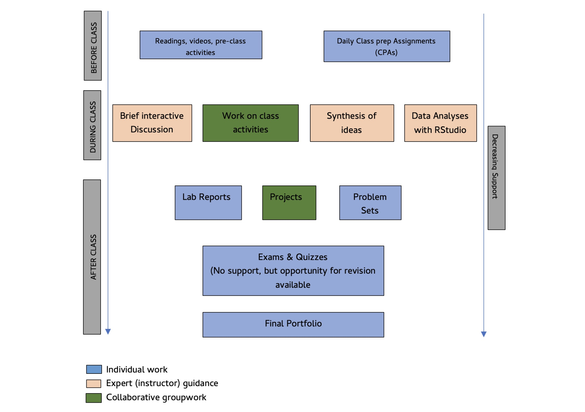

***Instructor:*** Prof. Joash Geteregechi

***Office Location:*** Williams Hall Room 311 E

***Open Hours:***

- Mon: 9.00 am-10.00 am, 12.00 - 1.00 pm (walk-ins allowed);

- Fri: 12.00 - 1.00 pm (walk-ins allowed).

- Fri: 12.00-1.00 pm (Math Support Center, Will 209)

- More hours (virtual) may be available. Please check here: [appointment](https://calendly.com/jmochogi/20min).

***Course Website:*** [Click here](https://jmochogi.github.io/business-stats-f26/).

### [Meeting Times and Location]{style="color:#003f5c;"}

**Class** meets at the following times:

| Day       | Room/Hall         | Time             |
|-----------|-------------------|------------------|
| Monday    | Williams Hall 202 | 10:00 - 10:50 am |
| Wednesday | Williams Hall 202 | 10:00 - 10:50 am |
| Thursday  | Williams Hall 319 | 10:00 - 10:50 am |
| Friday    | Williams Hall 202 | 10:00 - 10:50 am |

### [Catalog Description]{style="color:#003f5c;"}

A first course in statistics covering descriptive statistical techniques; introduction to probability; statistical inference including problems of estimation and hypothesis testing; correlation and regression analysis; and multiple regression. \[Most\] data sets and exercises will be chosen from the fields of business, economics, and management. Technology used in this course will include graphing calculators and statistical software \[R\].

### [Prerequisites and Credits]{style="color:#003f5c;"}

Math placement in group 2 or higher, math placement assessment score of 54 or greater, or completion of [MATH 10400](https://catalog.ithaca.edu/undergrad/coursesaz/math/), [MATH 10800](https://catalog.ithaca.edu/undergrad/coursesaz/math/), [MATH 11100](https://catalog.ithaca.edu/undergrad/coursesaz/math/) with a grade of C - (minus) or better.

The course is not open to students who have taken [MATH 14500](https://catalog.ithaca.edu/undergrad/coursesaz/math/) or [MATH 21600](https://catalog.ithaca.edu/undergrad/coursesaz/math/)   **Attributes:** 2B, ESTS, NS, QL   **Number of Credits:** 4 Credits

### [Course Format and Philosophy]{style="color:#003f5c;"}

This class will mostly be taught using a Flipped Classroom Model. A flipped classroom aims to increase your engagement and learning by having you complete some work (readings and/or videos) ahead of class. At the end of the pre-class work, you will complete a short quiz called a Class Preparation Assignment (CPA). I strongly recommend that you write down your own notes and any questions you have so we can address them in class or during office hours. More information about CPAs is provided under the Assessment section of this syllabus.

Here are some benefits of using a flipped classroom model:

- ***Independent Learning Skills:*** not everything you learn in school will be applicable **directly** in your job or in the real world. In most cases, you need to transfer your knowledge to new contexts and that often involves new learning (often on your own). A flipped class model sets you up for success as an independent learner. You will learn how to learn on your own.

- ***Active Learning:*** In a flipped classroom, you will be actively engaged in the learning process. You will be asked to think, to write, to discuss, to solve problems, to analyze, to create, to evaluate, and to apply. This is a much more effective way to learn than passively listening to a lecture.

- ***Catching up:*** If you miss a given class and you had completed your CPA, that means you will still have some understanding of the basic ideas. You do not miss out entirely and that means catching up is easier.

**Workload Expectation:**

This is a 4 credits course. Credit is earned at Ithaca College in credit hours as measured by the Carnegie unit. The Carnegie unit is defined as one hour of classroom instruction and two hours of assignments outside the classroom, for a period of 15 weeks for each unit (credit).

### [Student Learning Objectives]{style="color:#003f5c;"}

Upon successful completion of this course, students will be able to:

- Implement the model-simulate-evaluate process to address data-driven questions on real-world topics.

- Choose and use various statistical analysis techniques (exploratory and inferential) in a variety of “real life” business contexts.

- Critically analyze the use of statistics in research, in the media, and in various day-to-day life situations.

- Communicate statistical ideas effectively and in context without relying on statistical jargon.

- Use R statistical software to perform statistical explorations and manipulations.

- Effectively collaborate with peers on projects and presentations.

## [Course Resources]{style="color:#003f5c;"}

### [Textbooks]{style="color:#003f5c;"}

We will use the following texts in this course. The last book is only a reference and is helpful especially for labs. All books can be purchased in hard copy format on Amazon but are also available freely in electronic format.

- [Introduction to Modern Statistics](https://openintro-ims.netlify.app/) (IMS) by Çetinkaya-Rundel, Hardin. OpenIntro Inc., $2^{nd}$\$2\^{nd}\$ Edition, 2024. Hard copy available on [Amazon](https://www.amazon.com/dp/1943450277?ref=cm_sw_r_cp_ud_dp_84X75NFMXXJ0N6NTJAEF&ref_=cm_sw_r_cp_ud_dp_84X75NFMXXJ0N6NTJAEF&social_share=cm_sw_r_cp_ud_dp_84X75NFMXXJ0N6NTJAEF&skipTwisterOG=2).

- [OpenIntro Statistics](https://leanpub.com/os) (OS) by David Diez, Mine Cetinkaya-Rundel, and Christopher Barr. OpenIntro Inc., $4^{th}$ Edition, 2019. If you want a free copy, adjust the slider to 0. Hard copy available on [Amazon](https://www.amazon.com/OpenIntro-Statistics-Fourth-color-interior/dp/1943450226/ref=sr_1_1?crid=1ZSLGEV5B091L&dib=eyJ2IjoiMSJ9.aNYY-hcyRXQwV_7MIBRe888ggAKPJQvxRp6WEFgh38uMU-UenArv1ZMnFumj8Pdl0lWDpxtAjApdZI5S3rQJ2Q.lcBJYEVdBLBh8sMUNmGD6gjMJ4i-5IR3LPUoPyhZ4hA&dib_tag=se&keywords=openintro+statistics+fourth+edition&qid=1754933796&sprefix=openintro+s%2Caps%2C87&sr=8-1).

- [R for Data Science, 2e](https://r4ds.hadley.nz/), Wickham, Çetinkaya-Rundel, Grolemund. O'Reilly, 2nd edition, 2023. Hard copy available on [Amazon](https://www.amazon.com/dp/1492097403?&tag=hadlwick-20).

### [Computing:]{style="color:#003f5c;"}

- **R:** We will use R statistical environment with the RStudio interface. You’ll be using R primarily through a version of RStudio accessible online at [posit cloud](https://posit.cloud/). Once you are on this page, sign in or click on **sign up** to create a new account in case you don't already have an account. Note that you may use R locally on your computer but this option may present many technical issues for beginners. If you choose to use R locally, follow the steps below:

  - Download and install [R](https://cran.r-project.org/).
  - Download and install [RStudio](https://posit.co/download/rstudio-desktop/).

Note that RStudio is not the same as R. RStudio is a convenient interface that makes it easier to write and run R code. That is why you have to install R, then install RStudio. You do not have to worry about this if you use the online version.

- **Optional:** You may want to have a scientific calculator (one that has the ability to compute powers–e.g., $(1.675)^3)$ to use when you want to do quick calculations. You may also use online calculator tools such as [desmos](https://www.desmos.com).

## [Assessment]{style="color:#003f5c;"}

Your learning will be assessed in a variety of ways including Attendance and Participation (AP), Class Preparation Assignments (CPAs), Online Homework, Quizzes, Labs, Midterm Exams, Projects, and a Final Portfolio. Below are the details on these components.

### [Attendance and Participation (AP)]{style="color:#003f5c;"}

You’re expected to attend all classes and participate during class discussions. Consistent attendance and participation are strong indicators of success in MATH 144. You will be responsible for all course material, announcements, quizzes, and exams made in class, whether you attended that day’s class or not. I may post the announcements and materials on Canvas and/or send them out as emails. If you anticipate needing to miss more than **four class sessions**, please plan to meet so we discuss your options. Your attendance & participation will be gauged based on the following metrics:

- Punctuality to class and total number of classes attended
- Preparedness for class (you will generally be considered prepared if you do the CPAs).
- Level of engagement: Includes working collaboratively with others, sharing your thoughts during class discussions, and asking/answering questions.
- Contributing to online collaboration work and discussion forums.

For more details about the college attendance policy, see the [college-wide policies](#attendance-policy) section.

### [Class Preparation Assignments (CPAs)]{style="color:#003f5c;"}

CPAs are done ***prior*** to class. They involve completing short readings and/or watching explainer videos then answering a few questions based on the covered material. CPA's are meant to get you prepared for the material of the week/day so that you can contribute meaningfully during class. For this reason, deadlines for CPAs cannot be extended.

The lowest two CPA grades will be dropped at the end of the semester.

### [Online Homework - MyOpenMath]{style="color:#003f5c;"}

MyOpenMath is a free online homework system that allows you to complete homework online and grades your answers automatically. There will be about 5 homeworks over the course of the semester. The homework assignments will be based on the material covered in class and in the readings/vidoes. You are expected to complete all homework assignments by the due date (indicated on Canvas).

### [Labs]{style="color:#003f5c;"}

In labs, you will apply what you’ve learned in class to complete data analysis tasks. You may discuss lab assignments with other students; however, lab should be completed and submitted individually. Lab assignments will be submitted as reproducible reports, which allows someone else to rerun and check your analyses. You will learn more about this in class.

The lowest lab grade will be dropped at the end of the semester.

### [Quizzes]{style="color:#003f5c;"}

There will be a short quiz (10-15 mins) in class almost every week (usually Fridays). The quiz will be based mainly on material learned in the CPA and/or discussed in class for the current or previous week. To do well in these quizzes, you should complete your CPAs accurately, and attend class. If there are concepts you have questions about, be sure to ask. All Quizzes will be closed book and closed notes but you will be allowed to bring a one page A4-sized notes/formula sheet for your use. Do not just write formulas or notes without understanding them and how to interpret results.

The lowest quiz grade will be dropped at the end of the semester.

### [Projects]{style="color:#003f5c;"}

There will be two group projects for this class. These projects will be open-ended hence providing you opportunities to showcase your creativity in data analysis, drawing insights, and report writing. Your group will have 10-15 minutes to present your work in class. It is essential that each group member take an active part in the project work and presentation. Detailed information about the project, including a grading rubric, will be available on the external [course website](https://jmochogi.github.io/business-stats-f26/) under projects.

### [Midterm Exams]{style="color:#003f5c;"}

There will be two mid-term exams during the semester. A review session will be held in class a day before each exam. The review session is optional but you are highly encouraged to attend.

The exams will focus heavily on **conceptual understanding** of the course content and applications as opposed to **execution of procedures**.

### [Final Exam]{style="color:#003f5c"}

The final exam for this course will have two parts:

a.  **Final Portfolio:** A portfolio with the following:

- Revised work (if necessary) on both mid-term exams. Again, you should point out the errors on every problem and explain how your revisions fix your errors.
- A reflective essay on your main takeaways from the course and how you may implement that knowledge in your field or other real-life situations.

b.  **Oral Presentation:** You will be required to give a 10-minute oral presentation on a question related to the course content. This will be an individual presentation and you may be expected to use R to perform analyses. The question will be sent to you about 24 hours before your scheduled presentation time and solutions must be submitted to Canvas by 8.00 am on the day of the presentation. You should be prepared to answer questions from your peers and/or the instructor.

More information on the final Exam will be provided later in the semester.

### [Grading Policy]{style="color:#003f5c"}

Your final letter grade in the course will be weighted by category as follows:

| Category                      | Percentage |
|-------------------------------|------------|
| Attendance and Participation  | \_\_       |
| Class Preparation Assignments | 05%        |
| MyOpenMath Hw                 | 10%        |
| Labs                          | 10%        |
| Quizzes                       | 10%        |
| Midterm Exams                 | 30%        |
| Projects                      | 20%        |
| Final Portfolio               | 15%        |

The final letter grade will be determined based on the following thresholds:

| Letter Grade | Final Course Grade |
|--------------|--------------------|
| A            | $\ge$ 93           |
| A-           | 90 - 92.99         |
| B+           | 87 - 89.99         |
| B            | 83 - 86.99         |
| B-           | 80 - 82.99         |
| C+           | 77 - 79.99         |
| C            | 73 - 76.99         |
| C-           | 70 - 72.99         |
| D+           | 67 - 69.99         |
| D            | 63 - 66.99         |
| D-           | 60 - 62.99         |
| F            | $<$ 60             |

## [Course policies]{style="color:#003f5c"}

### [Academic honesty]{style="color:#003f5c"}

The point is very simple - [you should not cheat]{style="color:red"}. You should not present "someone" else’s work (including generative AI) as your own.

Abide by the following guidelines:

- **Collaboration:**

  - Work that is not assigned as a collaborative assignment should not be completed collaboratively. This does not mean you should not seek support from peers. If you seek help from your peers, be sure that you write your own solutions, otherwise the work will be similar and flagged for cheating. Submitting similar work will be considered a violation of the academic integrity policy by all students involved.
  - For team assignments (e.g., projects), you may collaborate freely within your team. Each group will submit one document contained agreed upon responses. No multiple file submissions.\
  - On individual assignments you may not directly share work with another student in this class, and on team assignments you may not directly share work with another team in this class.

- **Online resources:** In this century, the internet is a go to place for many things. While much of the information on the internet is useful, I expect that you will use it responsibly. The course policy is that you may use online resources (e.g., [StackOverflow](https://stackoverflow.com/), [Wolfram Alpha](https://www.wolframalpha.com/), etc.) but you must explicitly cite where you obtained any solutions you directly use (or use as inspiration).

- **Use of generative artificial intelligence (AI)**: Generative AI tools such as ChatGPT should be treated as other online resources. There are two guiding principles that govern how you can use AI in this course:

  - *Cognitive dimension:* Using AI tools should make you more efficient and productive rather than hampering your ability to think clearly and critically.

  - *Ethical dimension:* Students using AI should be transparent about their use and make sure it aligns with academic integrity. You are ultimately responsible for the work you turn in; it should reflect your understanding of the course content.

  - **✅ AI tools for code:** From time to time, I will demonstrate how to use AI for coding and will discuss how to use the tool responsibly without losing sight of the learning objectives.

  You may use [these guidelines](https://www.monash.edu/student-academic-success/build-digital-capabilities/create-online/acknowledging-the-use-of-generative-artificial-intelligence) for citing AI-generated content.

  - **❌ AI tools for narrative:** You should not use generative AI tools such as ChatGPT to write narrative on assignments. Interpretation of software output, writing up the project report, among others should be written by a human (YOU). If you want to use these tools to check your grammar, you should feel free to do so but be sure to disclose and cite it accordingly.

If you are unsure if the use of a particular resource complies with the academic honesty policy, please contact your instructor.

### [Late Work]{style="color:#003f5c"}

The due date & time for all assignments will be posted on Canvas and/or emailed out and/or announced in class. To enable me to prepare for class meetings and give you feedback, [I will not accept late work]{style="color:red"} except under extreme circumstances. If you know that you won’t be able to turn in an assignment on time, reach out to me in writing (email) at least one day before the due date to discuss your options. Note that there will be [no extensions on CPA's]{style="color:red"}.

### [Mobile devices & Other Technologies]{style="color:#003f5c"}

This class allows use of technology devices (e.g., computers, tablets, etc.) only for purposes of the course. Such purpose involves data analysis, writing reports, completing OneNote collaborative activities, among others. However, there will be moments (e.g., brief interactive discussion, completing paper activities,) when I require that students put away (or turn off) their technology devices. Use of these devices for purposes other than the one for the course is prohibited. Research on this matter shows that it distracts you as well as other class members. Two violations per week will result in a 0 score on the next attendance and participation grade. Persistent violation may necessitate further action to prevent you from distracting other students.

### [Teams]{style="color:#003f5c;"}

This class will mostly run through small group work (teams). You will be randomly assigned to a team at the start of the semester. About midway into the semester, I will switch people teams based partly on my professional judgement. I will allow you to suggest members you would like to work with but there are no guarantees that you will get grouped with all members of your choice. I generally seek to have mixed ability teams and to ensure that everyone has a chance to work with different people.

## [Getting Support]{style="color:#003f5c"}

There are various resources available to help you succeed in this course. Should you feel like you are struggling too much, please don’t hesitate to reach out to me so we can discuss possible ways forward. Below are some academic support services available to you.

### [Open Hours]{style="color:#003f5c"}

I will be available during open hours (Mon 12.00 - 01.00 pm) to answer questions or concerns that you may have in the course. You can simply walk in during the stated time above. More times may be available but you will need to check my schedule on [this link](https://calendly.com/jmochogi/20min?month=2024-08). Open hours may be held in-person or virtually depending on circumstances of the day. Below are the zoom link and passcode for virtual meetings:

**Zoom Link:** https://ithaca.zoom.us/j/3364817575?pwd=WlA1S3hJWWZNTTFoWUVaZlA1clhtdz09

**Passcode:** 850 424

### [Math Tutoring Sessions]{style="color:#003f5c"}

The mathematics department is committed to the success of all students enrolled in mathematics courses. Free one-on-one support for your mathematics coursework is available during select daytime and evening hours Monday-Friday at the Mathematics Room (Williams Hall 209). The Mathematics Room is staffed by mathematics faculty and vetted students. Student tutors offer support to fellow students in courses numbered 200 and below while math faculty offer support in any of the math courses. For more information and the schedule, please visit the [Math Support Center](https://www.ithaca.edu/academics/school-humanities-and-sciences/mathematics/courses-placement-resources/mathematics-support-center).

### [Tutoring & Academic Enrichment Services]{style="color:#003f5c"}

As a supplement to faculty advising and office hours, Tutoring and Academic Enrichment Services offers exceptional peer resources free of charge. Learning Coaches provide content-specific peer tutoring in a variety of courses. Peer Success Coaches mentor students who wish to develop collegiate-level academic and social engagement skills. To access these courses and for more information, please visit the [Center for Student Success](https://www.ithaca.edu/tutoring-services).

### [Writing Center]{style="color:#003f5c;"}

The Writing Center aims to help students from all disciplines, backgrounds, and experiences to develop greater independence as writers. We are committed to helping students see writing as central to critical and creative thinking. The physical location in Smiddy 107 will not be open to clients. For more information and scheduling appointments please visit the [writing center website](https://ithaca.mywconline.com).

## [Tips for Success]{style="color:#003f5c"}

Here are a few basic suggestions for how to succeed in this course:

### [Keep up with Homework]{style="color:#003f5c;"}

It is absolutely essential that you understand how to solve the assigned homework problems/exercises and, more importantly, how and why the skills and techniques presented in the course are used in solving the problems/exercises. I suggest that you begin working on the how as soon as possible. Do not pile your haw or work near the deadline. The advantage of getting the homework done on time is that you will get timely feedback that will help you understand the material better and hence do well in other assessment categories such as exams.

### [Attend Class Regularly]{style="color:#003f5c;"}

As noted earlier, attendance is a critical part of your success in this course. You should try to attend every class because it is during class time that we will delve deeper into the course material and practice with applications.

### [Stay Caught Up]{style="color:#003f5c;"}

Most concepts in this course build on each other cumulatively and you need to stay on top of the material at every stage. If you are having difficulty, don’t expect that the problem will take care of itself and disappear later. Contact me immediately and discuss the problem.

### [Collaborate with Peers]{style="color:#003f5c;"}

Many students benefit from sharing their work with others or by having their work questioned by their peers. You should attempt homework problems ahead of time by yourself and then note down any difficulties/questions that you can discuss with your peers. Even if you have no difficulties, you may still learn different and perhaps more efficient ways of solving the same problem during collaborative work. Below are some of the ways through which you can do this: - **Canvas Discussion Forums & One Note Collaboration Space** - You can post questions and answer others' questions here. I encourage you to scan hand-written work (if necessary) and upload it alongside your question so people can see how you are thinking.

- **Zoom sessions** – If you cannot meet in person, you can initiate Zoom sessions for collaborating. Zoom whiteboards are available to write on or you may simply have discussions. You can record these for later playback. If you want to invite me to your Zoom session, please send me an email with the link ahead of time and I will let you know if I am available to join.

## [College-wide Policies]{style="color:#003f5c;"}

### [Attendance Policy]{style="color:#003f5c;"} {#attendance-policy}

Students at Ithaca College are expected to attend all classes, and they are responsible for work missed during any absence from class. At the beginning of each semester, instructors must provide the students in their courses with written guidelines regarding possible penalties for failure to attend class. These guidelines may vary from course to course but are subject to the following conditions:

- In accordance with Federal Law, students with a disability documented through Student Accessibility Services (SAS) may require reasonable accommodations to ensure equitable access. A student with an attendance accommodation, who misses a scheduled course time due to a documented disability, must be provided an equivalent opportunity to make up missed time and/or coursework within a reasonable time-frame. An accommodation that affects attendance is not an attendance waiver and no accommodation can fundamentally alter a course requirement. If a faculty member thinks an attendance-related accommodation would result in a fundamental alteration, concerns and potential alternatives should be discussed with SAS.
- In accordance with New York State law, students who miss class due to their religious beliefs shall be excused from class or examinations on that day. The faculty member is responsible for providing the student with an equivalent opportunity to make up any examination, study, or work requirement that the student may have missed. Any such work is to be completed within a reasonable time frame, as determined by the faculty member.
- Any student who misses class due to a family or individual health emergency or to a required appearance in a court of law shall be excused. If the emergency is prolonged or if the student is incapacitated, the student or a family member/legal guardian should report the absence to the Dean of Students or the Dean of the academic school where the student’s program is housed. Students may consider a leave of absence, medical leave of absence, selected course withdrawals, etc., if they miss a significant portion of classwork. (Note: Graduate students may not take a leave of absence.)
- A student may be excused to participate in local, state, or federal elections. The student is responsible to make up any work that is missed due to the absence. Any such work is to be completed within a reasonable time frame, as determined by the faculty member.

A student may be excused for participation in College-authorized co-curricular and extracurricular activities if, in the instructor’s judgment, this does not impair the specific student’s or the other students’ ability to succeed in the course. For all absences except those due to religious beliefs, the course instructor has the right to determine if the number of absences has been excessive in view of the nature of the class that was missed and the stated attendance policy.

Students should notify their instructors as soon as possible of any anticipated absences.

### [Student Accessibility Services]{style="color:#003f5c;"}

In compliance with Section 504 of the Rehabilitation Act of 1973 and the Americans with Disabilities Act, reasonable accommodation will be provided to students with documented disabilities on a case-by-case basis. Students must register with [Student Accessibility Services](https://elbert.accessiblelearning.com/Ithaca/ApplicationStudent.aspx) and provide appropriate documentation to Ithaca College before any academic adjustment will be provided. Please note that accommodations are not retroactive, so timely contact with Student Accessibility Services is encouraged. To discuss accommodations or the accommodation process, students should schedule to meet with a SAS specialist. 607-274-1005 \| sas\@ithaca.edu.

### [Mental Health statement]{style="color:#003f5c;"}

The Ithaca College [Center for Counseling and Psychological Services](https://www.ithaca.edu/center-counseling-psychological-services) (CAPS) promotes and fosters the academic, personal, and interpersonal development of Ithaca College students by providing short-term individual, group, and relationship counseling, crisis intervention, educational programs to the campus community, and consultation for faculty, staff, parents, and students. Their team of licensed and licensed-eligible professionals value inclusivity, and they are dedicated to creating a diverse, accessible, and welcoming environment that is safe and comfortable for all those they serve and with whom they interact. CAPS sees students in-person at their offices in the Hammond Health building (side entrance), but Telehealth meetings through Zoom can be arranged in some circumstances. Staff in the office will answer questions by phone at 607-274-3136; please leave a voicemail if you do not reach a live person. You can also reach the office via email at counseling\@ithaca.edu. CAPS hours remain Monday-Friday 8:30 a.m. to 5:00 p.m. After-hours connections to a live counselor are available by calling the CAPS number and following the prompts.

In the event I suspect you need additional support, expect that I will express to you my concerns. It is not my intent to know the details of what might be troubling you, but simply to let you know I am concerned and that help, if needed, is available. Remember, getting help is a smart and courageous thing to do.

### [Academic Integrity]{style="color:#003f5c;"}

The College is an academic community, which values academic integrity and takes seriously its responsibility for upholding academic honesty. All members of the academic community have an obligation to uphold high intellectual and ethical standards. All forms of dishonesty including cheating and plagiarism are unacceptable. Failure to appropriately cite material used in a paper is plagiarism. The minimum penalty for cheating or plagiarism is a zero for the test or paper in question. Referral to college judiciaries is also possible. For more information on academic integrity and academic dishonesty, please refer to the [Student Handbook](https://www.ithaca.edu/student-affairs-and-campus-life/student-handbook), the College Catalog and the [Code of Student Conduct](https://www.ithaca.edu/policy-manual/volume-vii-students/71-general-student-policies/712-student-conduct-code) and Related Policies or ask your instructor.

### [Title IX Information]{style="color:#003f5c;"}

At Ithaca College, we believe that every individual has the right to be treated with respect and dignity and we support the creation and maintenance of a safe and positive living and learning environment. Students who experience sexual violence (including dating violence, stalking and sexual assault), sexual harassment, or discrimination based on gender or sexual identity) are encouraged to report their experience to the Title IX Coordinator, lkoenig\@ithaca.edu to explore formal and informal reporting options, and explore the support and resources available. The Title IX Coordinator will work with you to determine the best way to proceed and enhance the safety of our community. For more information go to: <https://www.ithaca.edu/share>.

Information shared in class assignments, class discussions, and at public events do not constitute an official disclosure, and faculty and staff do not have to report these to the Title IX Coordinator. Faculty and staff should be sure that access to campus and community resources related to sexual misconduct are available to students in the case these subjects do arise. Any other disclosure to faculty and staff can be reported to the Title IX Coordinator.

### [Academic Advising Center]{style="color:#003f5c;"}

Students are asked to consult with their faculty advisor, or the advising contact within their school, for all advising matters. Faculty advisors will be able to assist students with most advising questions, or they may collaborate with the dean's office for more complicated matters. Students can find the name of their assigned faculty advisor in Homer or in Degree Works.

### [Diversity and Inclusion]{style="color:#003f5c;"}

Ithaca College values diversity because it enriches our community and the myriad experiences that characterize an Ithaca College education. Diversity encompasses multiple dimensions, including but not limited to race, culture, nationality, ethnicity, religion, ideas, beliefs, geographic origin, class, sexual orientation, gender, gender identity and expression, disability, and age. We are dedicated to addressing current and past injustices and promoting excellence and equity. Ithaca College continually strives to build an inclusive and welcoming community of individuals with diverse talents and skills from a multitude of backgrounds who are committed to civility, mutual respect, social justice, and the free and open exchange of ideas. We commit ourselves to change, growth, and actions that embrace diversity as an integral part of the educational experience and of the community we create.Please learn more about Ithaca College’s commitment to diversity, equity and inclusion: <https://www.ithaca.edu/diversity-and-inclusion/diversity-statement>.

## [Sexual Harassment and Assault Response & Education (SHARE)]{style="color:#003f5c;"}

Please note that if you disclose an experience related to sexual misconduct (including sexual assault, dating violence, and/or stalking, sexual harassment or sex-based discrimination, your professor is obligated to inform the Title IX coordinator, Linda Koenig (lkoenig\@ithaca.edu), of all relevant information, including your name. The college will take initial steps to address the incident(s), protect, and, support those directly affected, and enhance the safety of our community. The Title IX coordinator will work with you to determine the best way to proceed. Information shared in class assignments, class discussions, and at public events do not constitute an official disclosure, and faculty and staff do not have to report these to the Title IX Coordinator. Faculty and staff should be sure that access to campus and community resources related to sexual misconduct are available to students in the case these subjects do arise. Any other disclosure to faculty and staff needs to be reported to the Title IX Coordinator. For more information: <https://www.ithaca.edu/share>.

## [Religious Observance]{style="color:#003f5c;"}

At Ithaca College, we uphold diverse religious and spiritual traditions - each with its own set of beliefs, practices, and observances that are part of our community. If you anticipate needing accommodations for attending class, taking exams, or submitting assignments due to a religious observance, you can work directly with me to accommodate your needs. Please share the potential dates with me as soon as possible so we can plan for your success in our class. The Office of Religious and Spiritual Life is also available to support you as you navigate your religious observances at IC. If you have questions or suggestions, please contact the Office of Religious and Spiritual Life at spirituallife\@ithaca.edu. More information on religious observances and accommodations at IC is available here.

\newpage

## [Important dates]{style="color:#003f5c;"}

- **Aug 24:** Classes begin.

- **Aug 30:** Last day to Add/Drop course.

- **Oct 21:** Fall Mid-Term Grades Due.

- **Oct 26-27:** Fall Break — No classes.

- **Oct 30:** Last Day to Withdraw with “W” Fall Semester Classes.

- **Nov 25-29:** Thanksgiving Break — No classes.

- **Dec 08:** Last day of classes.

- **Dec 09:** Reading Day.

- **Dec 10:** Final Exams Begin at 7.30 am.

For more information on dates, see the full [Ithaca College Calendar](https://www.ithaca.edu/academics/registrar/academic-calendars).
