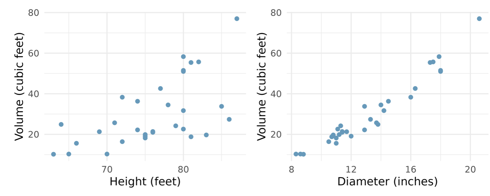

```{r}
#| label: load-packages
#| message: false

library(tidyverse)
library(openintro)
```

## Question 1

A prominent investment firm based in the US was interested in evaluating the portfolio management efficiency of its financial analysts. To conduct the study, 150 analysts were randomly selected from the firm's workforce. Among those sampled, 65 were classified as junior analysts, having less than five years of experience, while the remaining 85 were classified as senior analysts, with five or more years of experience. The analysts were responsible for managing investments across three key market sectors: technology, energy, and financial services.

The firm's primary focus was on how quickly analysts were able to generate a profitable return on a trade. On average, junior analysts required 5 days to close a profitable trade, whereas senior analysts were able to do so in about 2 days on average. Beyond trade execution speed, the firm also gathered additional information on each analyst, including their gender (male/female), their length of employment with the firm (in years), and the average total value (in millions of dollars) of the portfolios under their management.

a.  Classify this scenario as an *observational* or *experimental* study. Give a reason for your classification. \vspace{2cm}

b.  Write a possible *research question* that the company can answer using the data collected in this scenario. \vspace{2cm}

c.  Identify the *sample* and the *population* of interest. \vspace{2cm}

d.  What are the *cases/observational units* in this study and how many are they? \vspace{2cm}

e.  Identify any ***parameter*** and the associated ***statistic*** in this study. Indicate if each value is known or not. \vspace{2cm}

f.  List ***all*** the variables in the study and identify each variable as numerical or categorical. For each numerical variable state whether it is discrete or continuous. For each categorical variable state whether it is nominal or ordinal. \vspace{6cm}

g.  Identify a variable (or variable set if more than one) that can be reasonably visualized using:

    -   a simple bar plot \vspace{1cm}
    -   side-by-side box plots \vspace{1cm}
    -   a histogram \vspace{1cm}
    -   a scatter plot \vspace{1cm}
    -   a stacked or side-by-side bar plots \vspace{1cm}
    -   a contingency table \vspace{1cm}
\clearpage

## Question 2

Below are weights (in pounds) of 6 randomly sampled patients who visited St. Joseph's Clinic on a certain day. Assume that this sample, though small, is representative of the patients that visit this clinic.

$$182, 186, 177, 185, 183, 181$$

a.  Find the **5-number summary** for the weights then sketch a box plot to visualize their distribution. Describe the distribution of weights. Be sure to show all work.

\vspace{6cm}

b.  Calculate the *standard deviation* for the weights and interpret its meaning. Show/explain your work. \vspace{5cm}

c.  Suppose a nurse notices an error in the data entry. The weight entered as 186 lbs should have been 168 lbs. Without doing any calculations, state whether each of the following statistics will increase, decrease, or stay the same if the 186 is changed to 168. Explain your reasoning.

    -   mean \vspace{2cm}
    -   median \vspace{2cm}
    -   standard deviation \vspace{2cm}
    -   interquartile range \vspace{2cm}
    -   Range \vspace{2cm}
\clearpage

## Question 3

What is the relationship between tree height and diameter and the volume of timber produced? The following scatter plots depict the relationships between height, diameter, and timber volume in a sample of 31 felled black cherry trees, where diameter was measured at 4.5 feet above ground.

{fig-align="center" width="700"}

a.  Identify the predictor and response variable in each scatter plot. \vspace{2cm}

b.  Compare the relationships between variables as portrayed in the two scatterplots. Be sure to write in full sentences and in context. \vspace{4cm}

c. The calculated correlation coefficients for the scatter plots are 0.85 and 0.6. Assign each coefficient to the correct plot (left or right) and explain the reasoning for your matching.

\vspace{3cm}

d.  A linear regression using the plot on the left (height vs volume) was generated as $\hat{y}=0.34x+12.1$ where $y$ is the response and $x$ the predictor.

    i)  Interpret the *slope* and *intercept* of the linear regression model line in the context of the data. \vspace{4cm}
    ii)  Use the model to predict the volume of timber produced by a tree that is 65 feet tall and 11 inches wide(diameter). Show your work. \vspace{3cm}
    iii)  A tree that is 65 feet tall is observed to have a volume of 40 cubic feet. Calculate the *residual* for this observation and interpret its meaning in the context of the data. \vspace{4cm}
    iv)  Explain why it may not be appropriate to use this model to predict the volume of a tree that is 215 feet tall. \vspace{4cm}

    \clearpage
