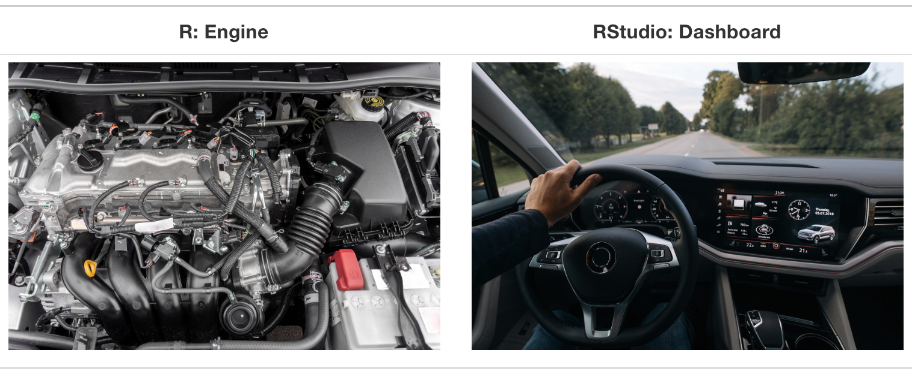
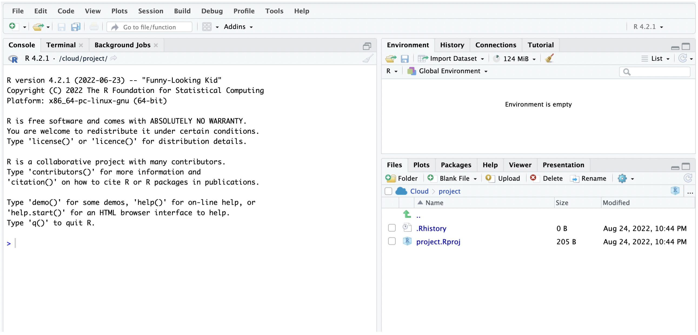

# `Hello, World!` {.unnumbered}

It is possible that some of you have heard/seen the phrase, `Hello, World!`, before. That is usually the first thing you learn in programming, i.e., to learn to write a computer program to print this sentence to screen. In this course, we will not print `Hello, World!` to the screen. Instead, we will learn how to use R (via RStudio) to perform statistical analyses and to write reports in order to communicate the insights learned from data. While the analysis involves writing computer code, it is in no way going to involve writing computer programs. The goal of today's lab is to introduce you to R and RStudio. You will learn to access and use RStudio, as well as perform the basic functions regarding statistical analysis. To clarify which is which: R is the name of the programming language itself and RStudio is a convenient interface (Integrated Development Environment or IDE) for working with R. I like to think about R as the car engine and RStudio as a nice driver dashboard. The engine drives the car, but the dashboard makes it easier for the driver to control the car. Most R users work with RStudio.



We will work with the cloud (online) version of RStudio.

## `Accessing RStudio Cloud` {.unnumbered}

To access RStudio online, click on the link [https://posit.cloud](https://posit.cloud){target="_blank"} to create an account or to sign in if you already have an account.

## Creating a new Project

After signing in to R studio, your next step is to create a new project. To create the project, you start by clicking on "New Project" and then change the default name (UNTITLED PROJECT) to "MATH 144 Fall 2026". You can think of a project as a folder or simply a collection of files/files with a specific goal in mind. Our project will be called "MATH 144 Fall 2026". All labs and assignments that require use of R will be saved in this project.

Yay! You now have your project ready.

Note that ***you won't have to create a project from scratch every time you open RStudio***. Next time you sign in, you just open the "MATH 144 Fall 2026" project and create a new file as needed. The number of projects you can have may be limited based on the subscription plan you have.

In the next section, we explain the meaning of the various panels on your screen.

## The R studio Interface

Your new R studio project interface will look as follows:



- ***Left Panel:*** The panel on the left is called the console. Every time you launch RStudio, it will have the same text at the top of the console telling you the version of R that you're running. Below that information is the symbol " \> ". This is where you enter your commands. When you enter and execute a command, the output will appear right below it. These commands and their syntax have evolved over decades (literally) and now provide what many users feel is a fairly natural way to access data, organize, describe, and invoke statistical computations. Try typing 1 + 1 in the console and hit enter.

  ```{r}
  1+1
  ```

- ***Upper Right Panel:*** The panel in the upper right contains, among other things, the history of the actions or commands that you've previously run successfully. We may refer to it as simply "environment".

- ***Bottom Right Panel:*** The panel in the lower right contains tabs for browsing the files in your project folder, access help files for R functions, install and manage R packages, and inspecting visualizations through the viewer tab. By default, all data visualizations you make will appear directly below the code you used to create them. If you would rather your plots appear in the plots tab, you will need to change your global options.

### Creating a new file

We want to create a new file (an R script) to write our code. To create a new file, click on the "File" menu, then click on "New File", and then click on "R Script". A new tab will open in the left panel. This is where you will write your code. You can save this file by clicking on the "File" menu and then clicking on "Save". Save the file as "lab_1_Explorations". If you did this correctly, a new file will appear under the files section (lower right) of the project.

### Functions and Arguments

In R, a `function` is piece of code that performs a specific task. Functions take inputs (called arguments) and return outputs. For example, the function `mean()` can take a vector input `x` (say a numerical variable) and return their mean. Here, the vector `x`, is considered an `argument`. You can add several arguments within a function as long as they are appropriate. For example, if `y` is a character vector (e.g., a list of gender labels), the command `mean(y)` would return an error message.

**NOTE**: Functions take the format `function()`. The parenthesis must still be included even if there are no specified arguments. As you will see later, some functions can assume certain defaults.

## Creating vectors in R

Suppose we want to find the mean of the numbers 23,24,26,19,18,25,21, and 39. The first thing may be to store these numbers as a `vector`. Specifically, this is a `numeric vector`. See code below for creating a vector consisting of the above list:

```{r}
x <- c(23,24,26,19,18,25,21, 39) 
# We use the symbol '<-' to assign the numbers to to x.
```

Here, we are creating a vector and storing it in an `object` called `x`. The symbols `<-` is used for assigning the list of numbers to `x`. In R, we use a `#` to designate a ***comment*** (i.e., text that should not be evaluated as code). The text after `#` above is a comment. Comments are a good way to document what your code is doing.

Now, to find the mean of those numbers, we use the function `mean()` and the argument `x` as shown below:

```{r}
mean(x)
```

To find the median of the numbers, we we would use `median(x)` as shown below.

```{r}
median(x)
```

We can also create a `character vector` (i.e., a series of non-numerical elements or characters). These elements are listed in quotes and separated by commas. See below:

```{r}
y <- c( "Jane", "John", "Jess", "Jeff", "Joe", "Holli", "Henry", "Han", "Jane") 
# We use quotes for strings.
```

Now, try to run the command **mean(y)**:

```{r}
mean(y)
```

Did you get an error message in red?

Well, programming languages generally produce error messages when you try to perform an inappropriate operation or if there is a mistake in the code. Error messages are a good way to learn what you did wrong. In this case, the mean/average of the object `y` does not make sense because the entries of `y` are not numerical.

You can, however, perform other operations on y. For example, you can use the `table()` function to tabulate the entries in `y`. This may be useful in cases where one is interested in the frequencies of each entry. Run the command below:

```{r}
table(y)
```

This is known as a frequency table. For example, we see that `Han` appears once in `y` while Jane appears twice. While you could easily count the frequencies, the `table` function is useful when you have bigger data sets.

Delete (or comment out) the `mean(y)` that you had written earlier.

## R packages

R is an open-source programming language, meaning that users can contribute packages that make our lives easier, and we can use them for free. Packages are simply pre-written code meant to serve specific purposes and may contain other packages inside them. Packages may also contain data sets. Packages are stored in a directory called `Library`. For most labs in this course, we will use the following two packages:

- The **tidyverse package** is a very popular "umbrella" package which houses a suite of many different R packages: for data wrangling (including tidying) and data visualization.

- The **openintro package** for data and custom functions with the openintro resources. You will notice that the readings frequently refer to data contained in the openintro Package. This is the package.

### Installing packages

We now want to install packages in our project. To install a package in R, we can use the function `install.packages` and the package name as the argument as shown below:

```         
install.packages("package name")
```

We run this command in the console because we only need to install packages once per project. After installing a package, we need to load (activate) it each time we relaunch RStudio.

To install **tidyverse**, run the following code in the **console**:

``` toml
install.packages("tidyverse")
```

**Exercise:** What code would you use to install the **openintro** package? Install the package.

Note: To launch (activate) the `tidyverse` package, we use the following command:

``` toml
library(tidyverse)
```

***Why Tidyverse?*** We are choosing to use the tidyverse package collection because it consists of a set of packages necessary for different aspects of working with data, anything from loading data to wrangling data to visualizing data to analyzing data. Additionally, these packages share common philosophies and are designed to work together. The tidyverse workflow makes coding feel like a natural language. You can find more about the packages in the tidyverse at tidyverse.org.

## Exercises

1)  Create a numeric vector (name it income) containing the following numerical elements: 750, 810, 680, 1200, 1500, 1399,1525.

2)  Find the mean and the median of the values in #1 above.

## Submission

::: callout-important
### Submission Checklist

- Attempt all questions
- Copy and paste your code and answers directly into Canvas under Lab 1 Exercises.
:::
