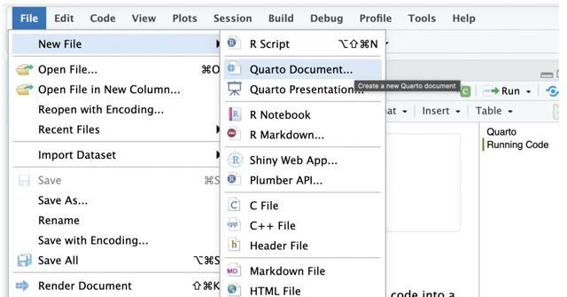

```{r, include=FALSE, echo=F}
library(tidyverse)
library(openintro)
```

```{r, include=F, echo=F}
data(duke_forest)
```

In this lab, we introduce an interface known as [quarto](https://quarto.org/) that is helpful in creating reproducible reports — documents that allow readers of your work to rerun and verify your analyses. You will recall that in our first lab, you used an R script and had to copy and paste your work to an external place such as a word document for submission. With a quarto file, you don’t have to do this. You can generate (render) documents in different formats (e.g., PDF, word, etc) for sharing and submission. Quarto allows you to write both code and plain text in the same document.

The code has to be written in what is known as `code chunks` while the plain (non code) text goes to the white spaces of the page.

We will also learn to use the [Tidyverse](https://ggplot2.tidyverse.org/articles/ggplot2.html) package (introduced and installed during lab 1) to perform basic summary statistics and contrast it with the base R approach (introduced in lab 1).

If you are using the desktop version of RStudio, you may need to download quarto first. Click [here](https://quarto.org/docs/get-started/) to download it.

## Getting Started with Quarto

To create your first Quarto file, follow the following steps:

Go to File\>New File \> Quarto document. See below:

{width="600"}

Next, save the document as `lab_2`. Note that if you do this correctly, it will appear as `lab_2.qmd` in your files pane. The `.qmd` extension indicates that this is a quarto file.

Now, click on `source mode` (top left corner of the document) to see the code behind the document.

Next, click on render to see what your rendered file looks like.

***Before you proceed, delete everything on the document except the YAML header (The section enclosed inside three dashes at top and bottom)***.

## Parts of a Quarto file

A quarto file has three main parts - the `YAML header`, `plain text` and `code chunks`. See details below:

### `YAML Header`

The YAML header is the part of the document that contains metadata about the document. It is located at the top of the document and is enclosed by three dashes (`---`) at the beginning and end. The YAML header contains information such as the title of the document, author name, date, output format, and other options that control how the document is rendered. Here is an example of a YAML header:

``` toml
---
title: "My Analysis Report"
author: "John Smith"
format: html
---
```

Notice that the YAML header is written in a specific format called YAML (YAML Ain't Markup Language). Each line in the YAML header consists of a key-value pair, where the key is followed by a colon (`:`) and the value. The keys and values are case-sensitive, and the values can be strings, numbers, booleans, or lists. For example, the `title` key has a string/character value of "My Analysis Report", the `author` key has a string value of "John Smith", and the `format` key has a string value of `html` (no quotes for format).

### `Plain Text`

Plain text is the part of the document that contains the main content of the report. It is written in Markdown, a lightweight markup language that allows you to format text using simple syntax. For example, when you are in `source mode` you can use `#` to create headings, `*` or `_` to create emphasis (italic or bold), and `-` or `*` to create lists. When in `visual mode`, it is easier to create these by using point and click options on the menu bar. It is often helpful to switch between the modes.

### `Code Chunks`

Code chunks are the part of the document that contains the R code used to perform the analysis. In source mode, code chunks are enclosed by three back ticks (\`\`\`) at the beginning and end, and they can be customized using various options. You can add a new chunk by clicking on the green plus sign on the menu bar and selecting `R` as the language. You can also use the keyboard shortcut `Ctrl + Alt + I` (Windows) or `Cmd + Option + I` (Mac) to insert a new code chunk. Source mode if often helpful for spotting errors in your code as it gives a line number for each line of code.

Note that in a quarto document, `#` creates headers when used in the *plain text* area but creates comments when used in *code chunks*

## Errors and Code Sequencing

To render means to process your quarto file and generating the output defined (in our case html). By default, rendering fails if your code has some errors, although this can be deactivated. The good news is that quarto will tell you where the errors occurred so you can fix them. If you want to see the exact line where the error occurred, you will need to switch to the `source` mode if you are in `visual` mode. It is important to note that code will run line by line starting from top to bottom. This means that your code must be ordered in some way. For example, if you need to use a `function` from a certain package (e.g., tidyverse), the package must be loaded first before calling that function. To load a package, you use the `library()` function.

## Using Code Chunks

In a code chunk, you write code that you want to reproduce in your report. There are other operations such as installing packages that should be done only in the console. For example, running `install.packages()` in a code chunk means quarto will try to install that package every time you render your document. Recall that we install packages only once in a given project. However, operations such as activating packages (i.e., `library()`) may be included in the quarto file near the ***top of the document***.

As a start, let us load the `openintro` and `tidyverse` packages. Recall that these packages were already installed (see lab 1). Copy and paste the following code in the first code chunk:

``` toml
library(openintro)
library(tidyverse)
```

## Loading Data from a Package

To load data stored in a package, we first make sure the package is installed and activated. Then, we used the function `data()` with the dataset name as the argument. We want to load a dataset called `duke_forest` from the `openintro` package. Since we already installed the `openintro` package and we have already loaded the package (see above), we use the code below:

``` toml
data(duke_forest)
```

To learn more about this dataset, you can use the `?` operator as shown below.

``` toml
?duke_forest
```

***Question:*** What can you say about this dataset? In particular, how many cases (observations) and how many variables does the data set have? Identify the variables by type (i.e., numerical or categorical).

## Some Analyses

We are going to use the price variable in the dataset to perform some analyses. Specifically, we will find the measures of center (mean and median) and measures of location such as quartiles and interpret these in context. We will use `base R` approach as well as functions from the `dplyr` package (part of the tidyverse package).

### `Base R Approach`

To get the mean of the price variable, we copy and paste the following code in a new code chunk:

``` toml
mean(duke_forest$price)
```

The `$` operator is used to extract a variable from a data frame. In this case, we are extracting the `price` variable from the `duke_forest` data frame.

### `Tidyverse/dplyr Approach`

To find the mean of the price variable using the `dplyr` package, we use the `summarize()` function. Copy and paste the following code in a new code chunk:

``` toml
duke_forest |>
  summarize(mean(price))
```

The `|>` symbol is known as the `pipe operator`. It is used to pass some 'instructions' (e.g., a data) or the output of one function to another function. In this case, we are passing the `duke_forest` data frame to the `summarize()` function.

Tidyverse uses the pipe operator a lot. Code written in this manner is (arguably) easier to read than the base R format. Not also that base R code can be quite cumbersome especially as you add more arguments.

For the most part, will use the Tidyverse workflow in this course.

To find the median of the price variable using both approaches, we proceed as follows:

``` toml
# Base R approach
median(duke_forest$price)
```

``` toml
# Tidyverse approach
duke_forest |>
  summarize(median(price))
```

To find the first quartile of the price variable using both approaches, we proceed as follows:

``` toml
# Base R approach
quantile(duke_forest$price, 0.25)
```

``` toml
# Tidyverse approach
duke_forest |>
  summarize(quantile(price, 0.25))
```

To find the third quartile, you can replace `0.25` with `0.75` in the code above.

To find the minimum value of the price variable using both approaches, we proceed as follows:

``` toml
# Base R approach
min(duke_forest$price)
```

``` toml
# Tidyverse approach
duke_forest |>
  summarize(min(price)
```

You can find the maximum value of the price variable by replacing `min()` with `max()` accordingly.

### 5-Number Summary and Boxplots

A box plot is a graphical representation of the five-number summary of a numerical variable. The 5-number summary includes the minimum, first quartile, median, third quartile, and the maximum value. If the min and/or max values are outliers, they are shown as isolated points beyond the whiskers on a box plot. To create a boxplot of the price variable, we can use the `boxplot()` function as shown below.

```{r}
boxplot(duke_forest$price)
```

Note that this code uses base R approach. We will learn to create box plots and other visualizations using a package known as `ggplot2` (part of the tidyverse package) in a later lab. Based on the box plot above, how would you describe the distribution of the `price` of the homes?

## Exercises

These lab exercises will be answered in the same quarto file used for the lab. You will start by creating a new level two Header called `lab 2 Exercises` and answer the following questions. The Question labels should use level 3 headers. When you are done, render the document to generate a clean PDF. To generate a pdf, you will have to change `html` format to `pdf` in the `YAML` header. Download the document and submit it on Canvas under Lab 2.

### Question 1

The `loan50` data set is found inside the openintro package. Load this dataset into your workspace. What are the observations/cases in the dataset and how many are they?

### Question 2

How many variables are in the dataset? Name any two ***numerical variables*** and any two ***categorical*** variables.

### Question 3

Compute the following summary statistics for the `annual_income` variable in the dataset.

```         
- Mean
- Median
- Standard deviation
```

### Question 4

Create a box plot to visualize the distribution of `annual_income`. Briefly describe the distribution of the variable based on the box plot.

### Question 5

Which measure of center (mean or median) would be more appropriate for describing the typical annual income? Briefly explain your answer.
